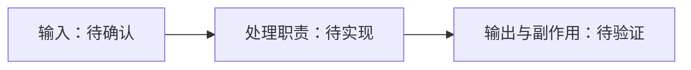

# fastbot_bringup 流程

这是待学习者替换的结构示例，不是当前实现的事实：

```mermaid
flowchart LR
  A["输入：待确认"] --> B["处理职责：待实现"]
  B --> C["输出与副作用：待验证"]
```

学习者先说明当前一个片段的输入、判断、状态读写与输出，再把节点替换为真实职责。
项目/包关系、节点协作与方法内阶段按问题分别表达。
运行时用 rqt_graph 核对真实连接，用调试/日志验证一次处理；不要把设计图当作运行证据。
